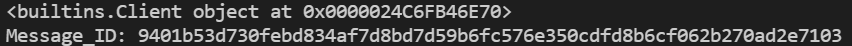

# MII_IOTA_PDF

## Objetivo
Proyecto de la asignatura 'Comunicación y Divulgación de la Ciencia y la tecnología' del Master de Ingeniería Industrial de la UPM. En este repositori se muestra un breve ejemplo de la capacidad de transmisión de archivos a través de Iota.

## Requierements
API de IOTA para python:
 *pip install iota_core_python-0.2.0_alpha.3-cp36-abi3-win_amd64.whl*

## Cómo funciona
Es un programa muy básico. El script *sending.py* permite enviar un archivo, actualmente apuntando a 0.txt; el script *receiving.py* permite replicar ese archivo en la misma carpeta.

### Instrucciones
- Se puede modificar, en *sending.py*, el identificador (*index*) por cualquiera valor.
- Se puede enviar cualquier tipo de archivo siempre que se especifique su nombre correctamente en *sending.py*:
```f = open("0.txt", "rb")```
- Cuando se envía un archivo se deben apuntar los siguientes parámetros:

- Este parámetro se introducirá en *receiving* línea 8.

